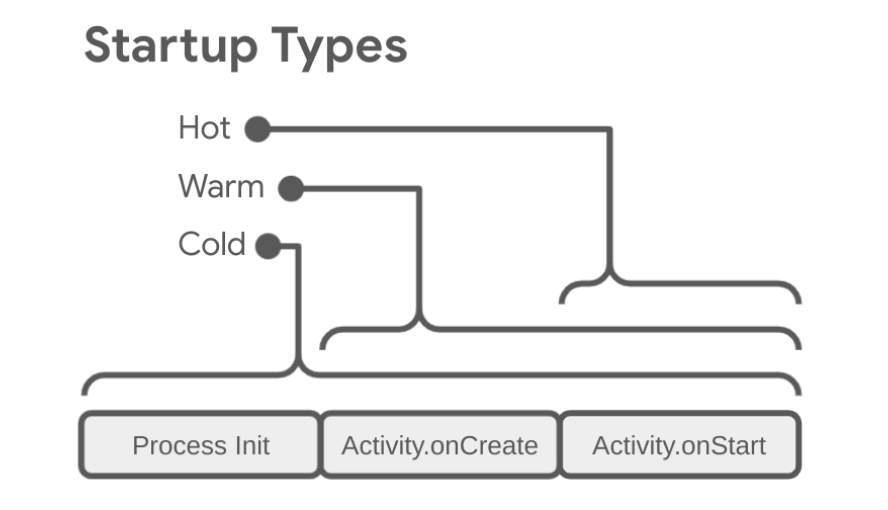
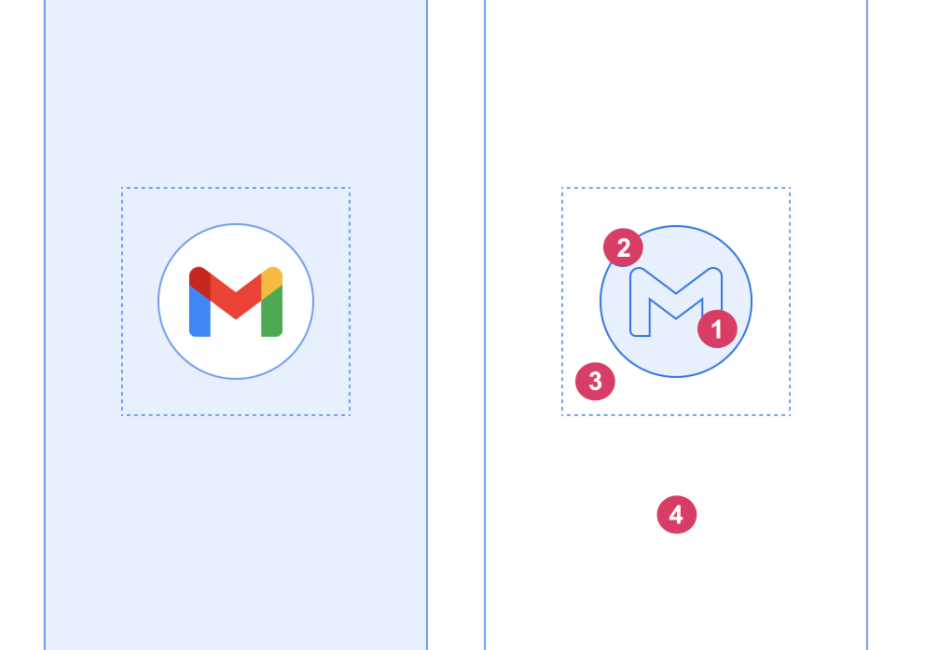

# SplashScreen
### Android 12에서 새로운 SplashScreen 표시
- Splash Screen API 제공

### 작동 방식

-  Cold Start, Warm Start - o   Hot Start - x
	- 시스템이 정의된 테마와 애니메이션으로 SplashScreen 표시
	- 앱이 준비되면, SplashScreen 닫히고, 햅 실행

	  

### 디자인 스펙

- Adaptive icons
	- ~~App icon with an icon background : 240 * 240 dp~~
	- ~~App icon without an icon background : 288 * 288dp~~
	- 108dp
- Branded image : 200 * 800dp ( Android 12 )
- 애니메이션
	- AVD ( AnimatedVectorDrawable )
	- 시간은 1000ms를 넘지 않는것을 추천
	- 1000ms넘는다면, looping animation 추천
	- delay Start할수 있지만, 166 ms 보다 길수없음


### Android 12에서 SplashScreen API 적용 이유
- Android 버전별 화면 다름 
- 기존 사용하던 Splash 화면과 중복
- 기존 Splash에서 사용되던, 데이터 로딩, 브랜딩효과 대체


## SplashScreen 적용
- 기본적으로 windowBackground, 런처 아이콘을 사용

1. theme 사용
2. 더 오랜시간 유지
3. Splash screen 닫기 애니메이션 


###  Splash Screen API 추가 방법
```
implementation 'androidx.core:core-splashscreen:1.0.0-beta02'
```

```
<style name="Splash.Theme" parent="Theme.SplashScreen">
	<item name="windowSplashScreenBackground">@color/white</item>
	<item name="windowSplashScreenAnimatedIcon">@drawable/ic_app_icon</item>

	<item name="android:windowSplashScreenIconBackgroundColor" tools:targetApi="s">@color/white</item>
	<item name="android:windowSplashScreenBrandingImage" tools:targetApi="s">@drawable/brand_image</item>

	<item name="windowSplashScreenAnimationDuration">1000</item>
	<item name="postSplashScreenTheme">@style/Theme.Base</item>
</style>

```

- parent - Theme.SplashScreen
- windowSplashScreenBackground - 백그라운드
	- 단일 색상, 단일 이미지만 가능
- windowSplashScreenAnimatedIcon - 앱 아이콘 
	- 크기 제한
	- 설정안해도 기본 앱아이콘 사용되지만, 제거하려면 color/transparent
- windowSplashScreenAnimationDuration -   애니메이션 시간
	- SplashScreen 유지시간과는 다름
- postSplashScreenTheme - SplashScreen 이후, 앱 기본 테마 


- windowSplashScreenIconBackground - 앱 아이콘 뒷 배경 ( Android 12)
- windowSplashScreenBrandingImage - 스플래시 화면 하단에 표시 - 디자인 가이드 라인에서는 권장 x  ( Android 12)


- 스플래시 화면 지정 
	- OnCreate 에서 super.onCreate() 이전에
```
val splashScreen = installSplashScreen()
super.onCreate()
```
  
- 스플래시 화면을 화면에 더 오래 표시 
	- splashScreen.setKeepOnScreenCondition { true }
	
- 스플레시 닫기 애니메이션 
	- splashScreen.setOnExitAnimationListener { splashScreenView -> }


### 기존 Splash화면 마이그레이션 
- 기존 라우팅용으로사용되던 경우, 
	- SplashScreen 사용하여, 렌더링 
```
	   override fun onCreate(savedInstanceState: Bundle?) {
        val splashScreen = installSplashScreen()
        super.onCreate(savedInstanceState)

        // Keep the splash screen visible for this Activity
        splashScreen.setKeepOnScreenCondition { true }
        startSomeNextActivity()
        finish()
     }

```
	

- 기존 브랜딩을 위한 화면의 경우
	-  ExitAnimation을 통해 자연스러운 브랜딩,, ( 하지만 SplashScreen 사용 추천 ) 
- 기존 Splash 화면 제거 
	- Application onCreate() 를 최대한 가볍게 유지하기 -  lazy 
		- SplashScreen 최소화
	- 필요에 따라서 Splash Screen 오래 유지하기 ( 데이터 로딩 등 )
		- splashScreen.setKeepOnScreenCondition 활용
	- Placeholder UI 활용 
	- 캐싱 사용 - 로딩 중 캐싱된 데이터 활용


### 적용후기 
- SpashScreen 화면 커스텀 영역이 너무 제한적 ( 아이콘 위치, 크기, 브랜딩 위치 등등 )
- 의도는 잘 알겠으나, 강제성은 좀,, 
- 아직 자잘한 버그 존재 ( 외부에서 앱이 실행시  SplashScreen 정상적으로 안뜨는 현상 )


### 다른 앱들 
- 대부분 아직 적용 x ( 중복사용 중 )
- SplashScreen 가이드에 따라감
- 공존 케이스
	- onCreate 최소화하고(background만 이용 ), 자연스럽게 기존 Splash 사용?(넷플릭스? )
	- 자연스러운 연결? (페북 트위터? )
 
